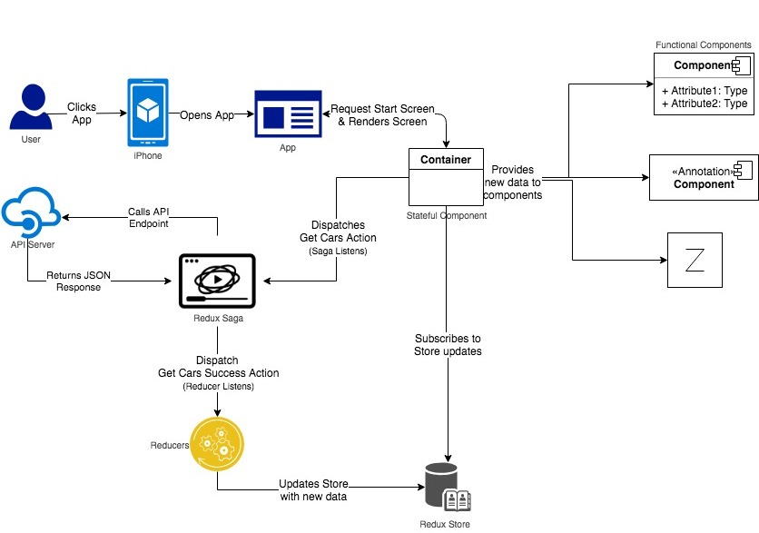

# FancyCars.ca

This is a simple react-native app for iOS

## Requirements

Details here [React Native Getting Started](https://facebook.github.io/react-native/docs/getting-started.html). But quickly

1. macOS and XCode (this is built for iOS and requires XCode 9+)
2. Node 8 or 10 and watchman, can be installed using [homebrew](http://brew.sh/).
    - ```brew install node```
    - ```brew install watchman```

3. react-native installed via the cli
    - ```npm i -g react-native-cli``` or
    - ```yarn add global react-native``` (yarn must be installed)
4. [json-server](https://github.com/typicode/json-server) for the api.
    - ```npm i -g json-server```

## Setup

1. Clone the repo
2. run ```yarn``` from inside the cloned directory to install all necessary package
3. run ```yarn start``` to start up the react-native bundler
4. In another terminal and within the cloned directory run ```json-server --watch ./App/api/db.json```
    - This starts the api server.
    - I have a sample db.json saved to serve a basic api with 2 endpoints (The response returned are random images and text not actual cars nor make)
        - [http://localhost:3000/cars](http://localhost:3000/cars) and
        - [http://localhost:3000/availability](http://localhost:3000/availability)
5. In another terminal and within the cloned directory run ```react-native run-ios```
    - This would start up the iPhone Simulator, install the application and run it.

## How it all comes together



## Notes

Haven't been able to update to High Sierra. I am still on Sierra with XCode 9.2 and couldn't use the awesomeness of the more recent React Native.

## Bugs

- When app loses connection and then regains connection, the infinite scroll does not work because onEndReach will have called already
